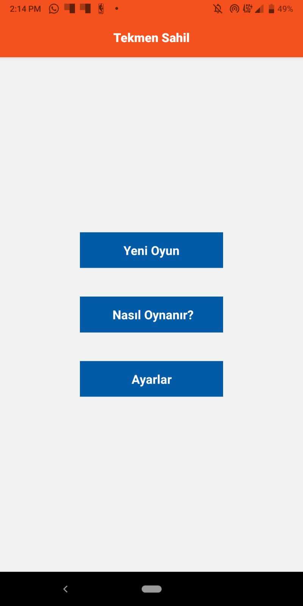
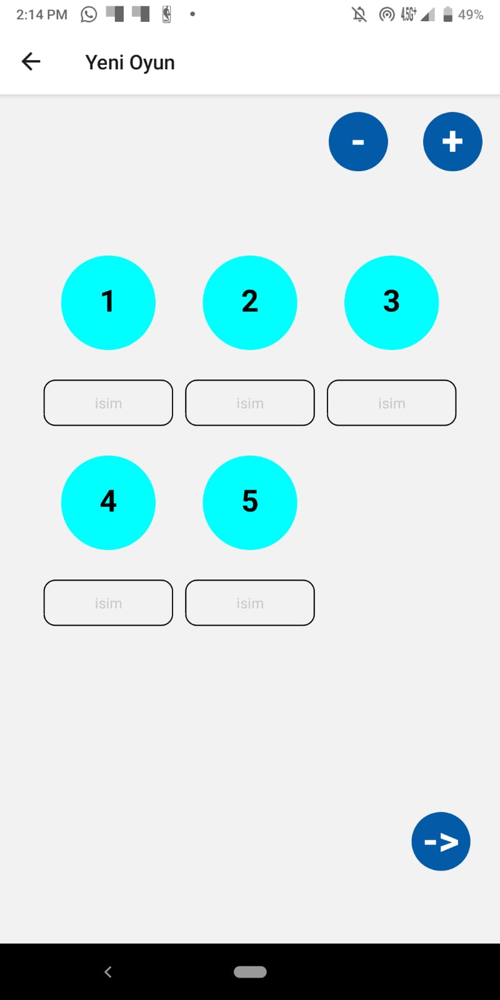
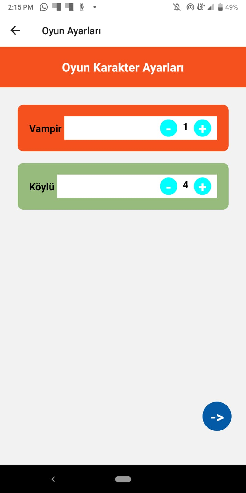
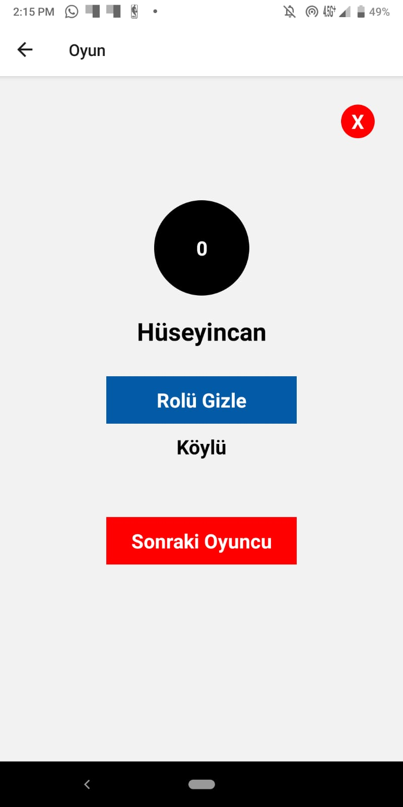

# Vampir-Koylu
Basit bir vampir köylü oyunudur.

- Bu projede React Native ve Expo kullanılmıştır.

# Google Play linki;

https://play.google.com/store/apps/details?id=com.tekmenbelediyesi.vampirkoylu

# Ekran Görüntüleri

  

  

  

  

# Nasıl Oynanır? 

Öncelikle Yeni oyun diyip oynayacak kişi sayısını ve isimleri giriyorsunuz. Ardından Vampir köylü sayısını ayarlayıp oyunu başlatıyorsunuz. Rolü Göster tuşu ile rolünüzü görebilirsiniz. Sonraki oyuncu tuşuna basıp diğer oyuncular da rollerini gördükten sonra oyuna başlayabilirsiniz.

# TODO

- Oyun sonu ekranı
- İsim yazılan menüye kart görünümü
- Fotoğraf ekleme

